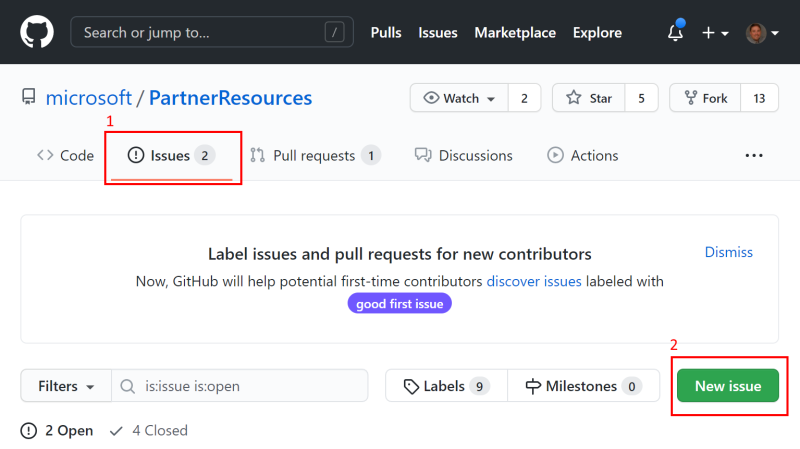
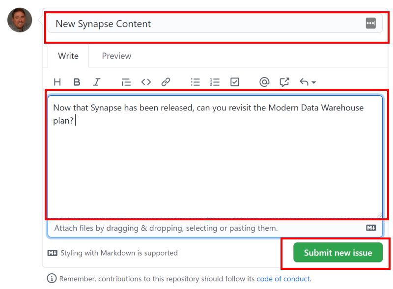
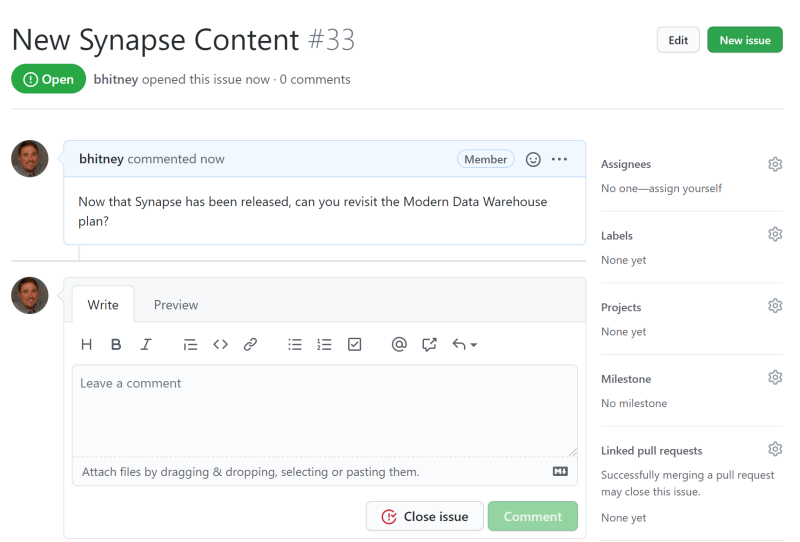
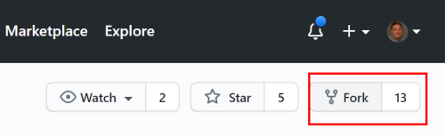
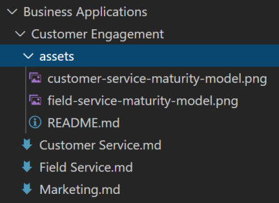

# Contributing

This project welcomes contributions and suggestions. Most contributions require you to agree to a
Contributor License Agreement (CLA) declaring that you have the right to, and actually do, grant us
the rights to use your contribution. For details, visit https://cla.opensource.microsoft.com.

There are several ways to contribute to this repository; here are the most common scenarios:

| Scenario | What to Do |
| -------- | ---------- |
| Make a suggestion or recommend new content | Open a new **issue** |
| Correct a typo, link, or other minor change | Create a **Pull Request** |
| Create an entirely new Learning Plan Resource | Create a **Pull Request** |

Read more on how to do these below.

## Open an Issue

We use **issues** to track general feedback and suggestions. Examples might include suggesting new content for a product or technical scenario that we haven't created yet, or providing feedback, problems or concerns with existing content. Follow these steps to create a new issue:

1. Make sure you have signed into GitHub.com with your GitHub account.
2. On the top of the screen within the Partner Resources repository, click *issues* and then the **New Issue** button:

3. Add a title and description and click **Submit new issue**. Please be as thorough as possible and provide relevant links if available.

4. Once the issue has been created, it's available for the team and others to comment on. You can revisit this issue to add more information or participate in any ongoing disussion. Once an issue has been resolved, it will be closed by the team (you may also close the issue).

## Modfying a document on Github

If you have a minor change -- such as a typo, updating a link, adding a line here or there -- you can edit the file directly on GitHub.com without having installing additional tools and software. Naturally, use whatever tools/editors you are most comfortable with. When you create these changes, the document is essentially copied into your own personal repository, and a **pull request** is then created that notifies the team that you'd like to see a change implemented. If the reviewing team accepts the change, these changes are merged into the original document. Similar to **issues** above, **pull requests** have a discussion thread in the event there are any questions or additional information is needed. 

Please refer to our [Template](/LearningPlanResources/Template.md) if you're unfamiliar with the sections we typically like to see in a document (of course, additional sections are always welcomed as appropriate). To make changes:

1. Make sure you have signed into GitHub.com with your GitHub account.
2. Go to the page you want to edit and click the edit button near the top right:

   

3. A fork of the project will be created in your account for editing purposes. Files in GitHub are written and edited using Markdown language. For help on using Markdown, see [Mastering Markdown](https://guides.github.com/features/mastering-markdown/). Select the **Preview changes** tab to view your changes as you go.  The editor will look like this:

   

6. When you're finished making changes, go to the **Propose file change** section at the bottom of the page:

   - A brief title is required. By default, the title is the name of the file, but you can change it.
   - Optionally, you can enter more details in the **Add an optional extended description** box.

   When you're ready, click the green **Propose file change** button.

      

7. On the **Comparing changes** page that appears, click the green **Create pull request** button. A check will be performed and allow you to confirm the submission.

      

8. A member of the team will review and approve your request, or if there are any issues, will respond with questions or comments.

## Creating new content

If you have multiple edits or are creating new plans and content, it's usually easiest to work on these outside of GitHub using an editor of your choice. Some popular editors include [Visual Studio Code](https://code.visualstudio.com/), [Visual Studio](https://visualstudio.microsoft.com), [Notepad++](https://notepad-plus-plus.org/), and countless more.  Some text editors, like Visual Studio Code, allow you to preview MD files so you can be sure links and formatting appear as intended.

To get started, clone the repository either locally or into your own GitHub account. You may use GitHub.com to fork the repository into your own account by clicking the fork button near the top right:

If you are creating new content locally on your computer, many software packages allow you to clone a repository from GitHub directly (such as Visual Studio Code), or you may use a tool like [GitHub Desktop](https://desktop.github.com/) to manage downloading the repository and uploading any changes; this allows you to use whatever tool you'd like. More on using GitHub desktop in a bit.

The key to remember is that all documentation is stored in Markdown (MD) format. MD is a lightweight markup syntax for documents that allows them to be easily created and consumed. MD files may contain images, lists, and tables -- use this [Masterking Markdown guide](https://guides.github.com/features/mastering-markdown/) to learn more. Also, while you can copy any existing plan to use as a template, we have an [emtpy template](/LearningPlanResources/Template.md) that you can use to get started.

If you are including any images in your plan, be sure to upload them to the local assets folder. For example, under Business Applications -> Customer Engagement, there are 2 images in the assets folder that are used in the plans in the Customer Engagement section:

You may also have other assets like Visio diagrams or PowerPoint presentations; please keep sizes reasonable. For videos, we prefer they are hosted on a service designed for video hosting and linked to from the plan.

When you have completed your MD file, you're ready to create a pull request. This process varies depending on tooling, so for more information on doing this with GitHub desktop and Visual Studio Code, see the next section.

## Using Visual Studio Code and GitHub Desktop

