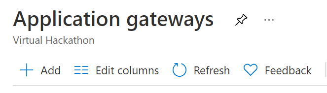

# LAB10 – Connect from Azure Application Gateway to AVS hosted workload

This lab shows you the steps to use Application Gateway in front of a web server
farm to protect a web app running on Azure VMware Solution. This will allow
using Azure Application Gateway as layer 7 web traffic load balancer that lets
you manage traffic to your web applications that are hosted inside AVS Private
Cloud. You can refer to the original article: [Use Azure Application Gateway to
protect your web apps on Azure VMware Solution - Azure VMware Solution \|
Microsoft
Docs](https://docs.microsoft.com/en-us/azure/azure-vmware/protect-azure-vmware-solution-with-application-gateway)

An additional possible step is configuring Azure Traffic Manager to direct
traffic between three Azure Application Gateways spanning several Azure VMware
Solution regions. As explained in this article: [Deploy Traffic Manager to
balance Azure VMware Solution workloads - Azure VMware Solution \| Microsoft
Docs](https://docs.microsoft.com/en-us/azure/azure-vmware/deploy-traffic-manager-balance-workloads)

So, let’s start the steps of configuring a VM hosted in Azure VMware Solution
Private Cloud in the Backend Pool of Application Gateway:

1. Go to Azure Portal, search for “Application Gateways”, click on
   **Application Gateways**.  

   

2. Click on Add in Application gateways pane, to create a new Application
   Gateway instance in case you don’t have an existing one.  

   

3. Fill out the main fields at the **Basics** section to start creating a new
   Application Gateway, such as **Subscription**, **Resource Group**, **Name**,
   **Region**, **Tier**, **Virtual Network** and **Subnet**. Keep the same
   values in the other pre-populated fields.

   1. Note that the **Region** of the Application Gateway needs to be in the
      same region of the **vNet** that’s connected to AVS Private Cloud. In
      the example below it is **South Central US**.

   2. Note that in this lab the **vNet** exists and is called **AVS-vNET** and
      the **subnet** for Application Gateway has also been created and called
      **AppGateway** which should show up in the drop-down list.

      

4. Move to **Frontends** section and create a new **Public** IP as you notice
   in the screenshot below. A suggested name is **AVS-AppGateway-PublicIP**.  

   

5. Move to **Backends** section. Click on **Add a backend pool** to create a
   new Backend pool, you can name it: **AVS-AppGateway-BackendPool**. Next is
   to populate the **IP**s of the web server farm VMs hosted in AVS Private
   Cloud. You can get the IPs from **vCenter** portal, or from the VMs directly
   by running **ipconfig** command in Windows or **ifconfig** command in Linux
   based operating systems.  

   The IP Address you see in the screenshot below should be the same as the IP
   of PhotoOS VM that you deployed in the earlier lab.

   

6. Next, move to **Configuration** section, where you need to click **Add
   Routing rule** to map the Frontend with the Backend pool:

   

7. Give the rule a name, i.e.: **AVS-AppGateway-RoutingRule**.

   1. Under the **Listener** section, add a **name** for the listener, i.e.:
      **HTTP-Listener**,

   2. Select **Frontend IP**: **Public**, select the **Protocol**: **HTTP**
      (for demo purposes), specify the **Port**: **80**. Keep **Additional
      settings** as is. 

   3. Move to **Backend targets** section, select **Target type: Backend
      pool**, then select the created backend pool in the **Backend target**.
      Then create HTTP settings as in the next step.  
      

   4. Adding **HTTP settings** by giving them a **name**, i.e.:
      **HTTP-Settings**, selecting **Backend protocol: HTTP**, and **Backend
      port: 80**. Keep other settings as is. Click **Add** button, to finish
      the HTTP settings.  

      

   5. After adding the Listener and the Backend targets, you should land again
      at **Add** **a Routing rule** pane. The last step at the **Add** **a
      Routing rule** pane is to click **Add** button to finish that wizard.

8. Now, move to **Review + Create** section and click on **Create** button, as
   you see in the screenshot below.

   

9. Creating an Application Gateway takes about 15 minutes to complete.

   

10. Go to the created Applicate Gateway by clicking on its name as shown in the
    previous step, i.e., **AVS-AppGateway**. Notice the **Frontend public IP
    address**. Copy **IP** value. **  
    **

11. Open a new Internet browser (Edge/Chrome) tab and put the IP in the address
    bar with ‘**http://**’ prefix,  
    i.e.: [**http://20.188.90.231**](http://20.188.90.231)

    **Notice now that you can access the web application hosted at the web
    server farm that is hosted in AVS Private Cloud**, in this case it’s the
    default **Nginx** page.

    

## Next Steps

[Back to Table of Content](toc.md#table-of-contents)

[Lab 11](lab-11.md)
