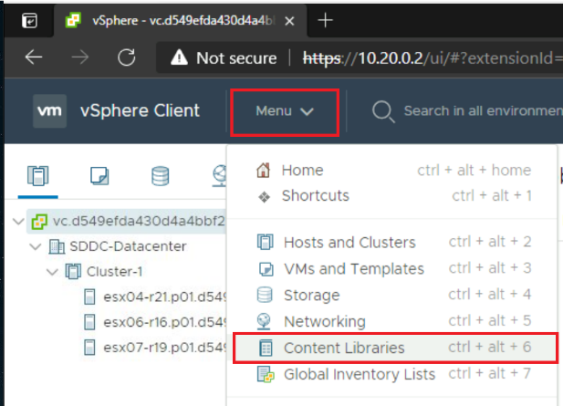
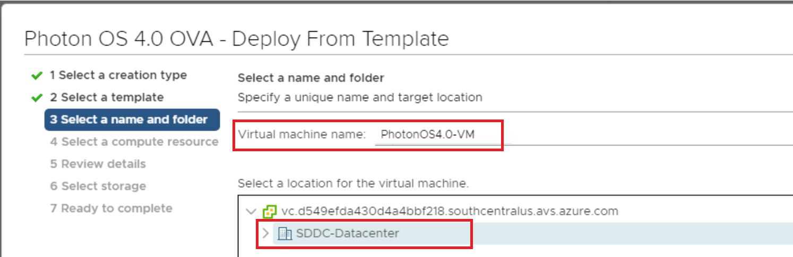
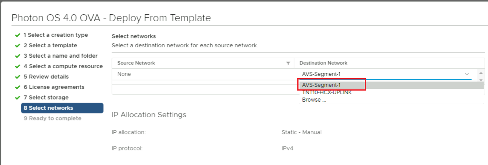
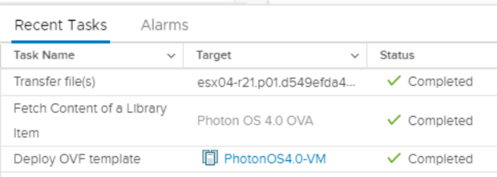
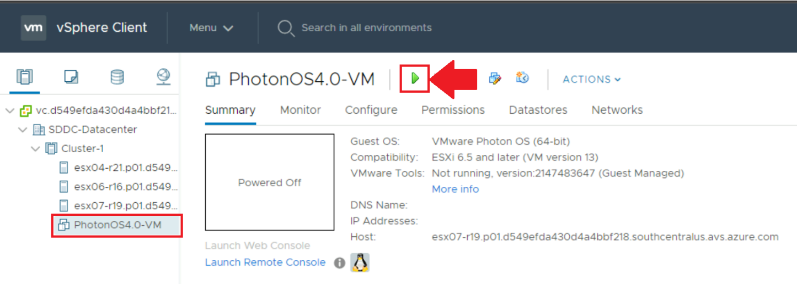
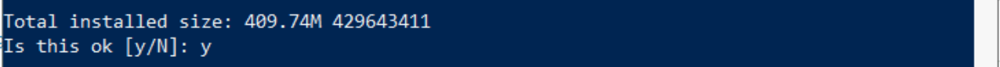
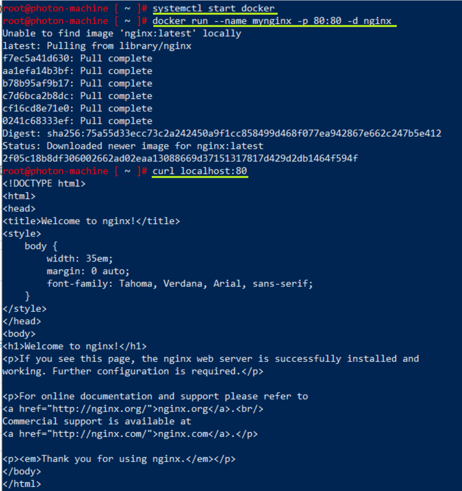

# LAB6 – Deploy a virtual machine on Azure VMware Solution

With your Azure VMware Solution Private Cloud deployed and configured the next
step would be to deploy a virtual machine on it.

You can do that in two ways, create the VM and install the operating system
manually or use an OVF/OVA appliance. You can follow this link to learn more
about OVF ([Open Virtualization Format](https://www.dmtf.org/standards/ovf))

For this lab you will use an OVA appliance since it is faster and easier. You
are going to deploy a Photon OS, which is a VMware owned and developed Linux
distribution. That can be done in two ways:

1. Deploy the OVA directly using a URL as a source. (See Appendix)

2. Deploy the OVA from Content Library.

It’s up to you to decide which way you want to proceed with. The natural flow is
to deploy from the Content Library since you already added the OVA to it in the
previous lab. But you are welcome to deploy from URL directly (see appendix).
After you start the deployment Wizard, the steps are common between both methods
as you will see.  

Deploy VMware Photon OS OVA Content Library

1. There are two ways to start this, by first going to **vCenter** portal from
   the **Jumpbox**:

   1. Start from the **Content Library**.
      1. In the **vCenter** portal, click on **Menu** and select **Content
         Libraries**.

            

      2. Select the Content Library that you want to take the OVA/ISO from,
         as you see below:

            

      3. Select the OVA. For example: Photon OS 4.0 OVA

            

      4. Go to **Actions** and select **New VM from This template**.

            

   2. Or, from the **Hosts & Clusters** page.

      1. Right click on the Private Cloud and select **New Virtual
         Machine**.

            

      2. Select **Deploy from template** 

            

      3. Specify the template. For example: Photon OS 4.0 OVA

            

2. Provide the **VM Name**. For example: **PhotonOS4.0-VM** and select which
   data center you want to deploy the VM at (i.e., Location). Click **Next**.

    

3. Select the **compute resource**, i.e., **Cluster-1** and click
   **Next**.

    

4. **Review details**, click **Next**.

5. **Accept License agreement**, click **Next.**

6. Select the **VM Storage Policy**, change it to **Thin Provision**, then
   click **Next**.

    

7. In the **Select networks** step, select the **segment** you’ve created
   previously as your **Destination Network**. In this example:
   **AVS-Segment-1**. Then click **Next**.

    

8. Review details and then click **Finish** to start creating the actual VM.

   

9. You’ll notice the following in the Recent Tasks area:  

   

10. Now the VM should be ready, and you will need to start it. Click on the
    green run button ▶

    

11. Once the VM is running, you’ll notice the IP Address will be assigned to the
    VM. Copy that IP address as you’ll use it to SSH into the VM.

    

12. Open PowerShell from the Jumpbox machine and run the following command to
    SSH into the created VM. The PhotonOS gets a default **password** for the
    **root** account, which is: **changeme**  
    You’ll be prompted to change it the first time you SSH into the VM. Please
    remember that password as you may need it in other exercises. The command
    is:
    ssh root@10.20.220.100  

    ![vm change password]](media/lab-6/vm-change-password.png)

13. Update the VM, by running the command:  

    ```bash
        tdnf update
    ```

    

    

14. To install nslookup utility use the command:

    ```bash
        tdnf install bindutils
    ```

    

15. Test Internet Connectivity and DNS functionality, run:

    ```bash
        nslookup www.bing.com  
    ```

    then:

    ```bash  
        curl www.bing.com  
    ```

      

    **You will notice that you can reach the Internet from the VM, and resolve
    Internet URLs to IP addresses.  
    **

16. Follow these steps to run Nginx Web Server container on Photon OS. These
    steps were derived from this article [Run NGINX and NGINX Plus in Containers
    on Photon OS](https://www.nginx.com/blog/nginx-plus-photon-os/). This step
    is important and considered as a prerequisite for upcoming two labs:

    1. Connect from Azure Application Gateway to AVS hosted workload.

    2. Assign Public IP to virtual machine on Azure VMware Solution.

       Run these commands to run NGINX Web server container:

       ```bash
        systemctl start docker
        docker run --name mynginx -p 80:80 -d nginx
        curl localhost:80
       ```

       

Now the VM is ready for the upcoming labs, where you’ll public this webserver
to the Internet in two different ways, as you’ll notice.

## Next Steps

[Back to Table of Content](toc.md#table-of-contents)

[Lab 7](lab-7.md)
