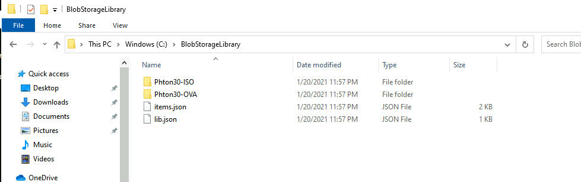

# LAB14B – Create a remote content library in Azure Blob Storage

Azure Blob Storage can be leveraged as the storage backend for a content
library, freeing up space in the vSAN datastore for the workloads. Also, a Blob
Storage backed content library can be share across different SDDCs running on
Azure VMware Solution.

Prepare the content and folder structure

The first task would be to build the content for the library in local disk, for
this you will use the Jumpbox. Access Photon OS download page on
<https://github.com/vmware/photon/wiki/Downloading-Photon-OS> and download the
OVA file for Photon 3.0 and the Minimal ISO for x86_64.

Create folder in C:\\ with the name **BlobStorageLibrary**. Create a
**Photon30-ISO** folder and a **Photon30-OVA** folder and move there from your
**Downloads** folder the ISO and the OVA files, respectively.


Prepare the content library in the Jumpbox

To build the content library itself on local disk you will need a to run a
Python script, the script can be get from
[GitHub](https://github.com/lamw/vghetto-scripts/blob/master/python/make_vcsp_2015.py).

Download and install the latest version of [Python for
Windows](https://www.python.org/downloads/), make sure you select the option to
get Python in the PATH. Once Python installation has finished open a CMD
terminal session and run the script with the following parameters.

python make_vcsp_2015.py \<library name\> \<library location on disk\>

For example:

```dos
C:\>python make_vcsp_2015.py BlobStorageLibrary C:\\BlobStorageLibrary
```

Check the content library content and you will see tow JSON files:

- items.json

- lib.json

Also, there is an item.json file on each folder.



Create Azure Blob Storage infrastructure

You are going to create now all the Azure Storage resources that will contain
the new content library. Access Azure portal and search for **Storage
accounts**. Click on **Create**.

In the first screen enter the name, select the resource group, or create a new
one and the Location. For **Account kind** select **StorageV2 (General purpose
v2)** and set **Replication** to **Locally-redundant storage (LRS).**


Leave the rest of the parameters with the default values and go to the **Review
\+ create** screen and select **Create**.

Upload the content to Blob Storage

Download and install [Azure Storage
Explorer](https://azure.microsoft.com/en-us/features/storage-explorer/)
application, you are going to use it to configure the storage account and upload
our library.

Launch Azure Storage Explorer, in the **Add an Azure account** screen login with
your Azure credentials and select your Azure subscription.

Expand your storage account, right click on **Blob Containers,** and select
**Create Blob Container**. Enter the name for the container.


Select the new container and in the right are click on **Upload \> Upload
Folder** and select the local folder containing the library.

After the upload is finished access the folder and right click on the lib.json
file and select **Copy URL**.


By default, the access level of a blob container is set to **Private**, before
creating our content library you will need to change that access level. The
recommended way is to setup proper access and authentication to access the blob
container but for the purposes of the lab you will give it anonymous read access
level.

Access Azure portal and go to your storage account. Go to Containers, select you
blob container and click on **Change access level**.


Set the **Public access level** to **Container (anonymous read access for
container and blobs)** and click **OK**.


Create the content library in AVS vCenter

Access vCenter and in the drop-down menu select **Content Libraries**. Click on
**Add**. Enter the name for the library and select the AVS vCenter Server.

In the **Configure content library** screen select **Subscribed content
library** and paste the URL you copied from Azure Storage Explorer.


Finish the creation process of the content library as with the local one. If you
have selected download content immediately, the AVS vCenter Server will download
all the templates and ISO files from the library but if you select **when
needed** it will download the content as needed, saving space in the local vSAN
datastore.

## Next Steps

[Back to Table of Content](index.md#table-of-contents)

[Appendixes](appendixes.md)
