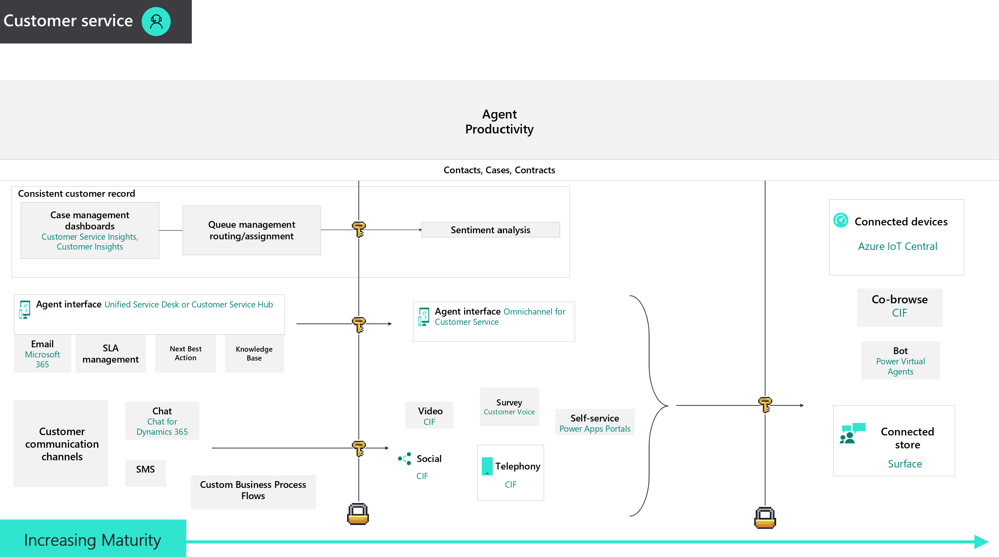

# Learning Plan Resources for Dynamics 365 Customer Service

Dynamics 365 Customer Service is a Microsoft business application that empowers companies to deliver end-to-end, self, assisted and onsite service across multiple channels.  The role of customer service continues to evolve as organizations sell services around their products and provide break-fix support for their customers.  This Customer Service application enables organizations to provide these personalized support services with a rich set of capabilities.

Below you will find content to assist in upskilling on Dynamics 365 Customer Service.  Content is broken down as follows:

* Fundamentals, Associate, Expert, Specialist: content categorized in increase levels of complexity
* Certifications:  relevant Microsoft exams or certifications
* Community resources:  user groups, events, blogs

Additionally, some content may be mared with one or more icons:

* '$' to indicate paid content
* '3rd Party' to indicate 3rd party content (not created by Microsoft)

TIP:  Open resources below in a separate browser tab to remain on this Learning Plan page - Right-Click on link and open in new tab.

## Fundamentals

* [Course MB-901T00-A: Microsoft Dynamics 365 Fundamentals](https://docs.microsoft.com/en-us/learn/certifications/courses/mb-901t00) (In-person Instructor Led) (2 Days)
* [Course PL-900T00-A: Microsoft Power Platform Fundamentals](https://docs.microsoft.com/en-us/learn/certifications/courses/pl-900t00) (In-person Instructor Led) (2 Days)
* [Get started using Common Data Service](https://docs.microsoft.com/en-us/learn/paths/get-started-cds/) (Microsoft Learn) (4 Hours)
* [Introduction to Dynamics 365 Customer Service](https://docs.microsoft.com/en-us/learn/wwl/introduction-dynamics-365-customer-service/) (Microsoft Learn) (1 Hour)
* [Microsoft Dynamics 365 Fundamentals](https://docs.microsoft.com/en-us/learn/paths/dynamics-365-fundamentals/) (Microsoft Learn) (11 Hours)

## Associate

* [Work with cases in Microsoft Dynamics 365 Customer Service Learning Path](https://docs.microsoft.com/en-us/learn/paths/work-with-cases-in-dynamics-365-for-customer-service/) (Microsoft Learn) (4 Hours)
* [Course MB-200T01-A: Dynamics 365: Power Platform applications](https://docs.microsoft.com/en-us/learn/certifications/courses/mb-200t01) (In-person Instructor Led) (2 Days)
* [Course MB-200T02-A: Dynamics 365: Power Platform automation](https://docs.microsoft.com/en-us/learn/certifications/courses/mb-200t02) (In-person Instructor Led) (1 Day)
* [Create a model-driven app in Power Apps](https://docs.microsoft.com/en-us/learn/paths/create-app-models-business-processes/) (Microsoft Learn) (1 Hour)

## Expert

* [Course MB-400T00-A: Microsoft Power Apps + Dynamics 365 Developer](https://docs.microsoft.com/en-us/learn/certifications/courses/mb-400t00) (In-person Instructor Led) (3 Days)
* [Becoming a Solution Architect for Dynamics 365 and Power Platform Learning Path](https://docs.microsoft.com/en-us/learn/paths/become-solution-architect/) (Microsoft Learn) (4 Hours)
* [Implementing Customer Engagement Online Learning Path](https://docs.microsoft.com/en-us/learn/paths/implementing-customer-engagement-apps/) (Microsoft Learn) (5 Hours)
* [Extend Dynamics 365 Portals](https://docs.microsoft.com/en-us/learn/paths/extend-dynamics-365-portals/) (Microsoft Learn) (3 Hours)
* [Extending the Common Data Service](https://docs.microsoft.com/en-us/learn/paths/extend-power-platform-common-data-service/) (Microsoft Learn) (2 Hours)
* [Extending the Power Platform user experience Model Driven apps](https://docs.microsoft.com/en-us/learn/paths/extend-power-platform-model-driven-app/) (Microsoft Learn) (4 Hours)

## Certifications

* [Exam PL-200: Microsoft Power Platform Functional Consultant (beta)](https://docs.microsoft.com/en-us/learn/certifications/exams/pl-200)
    * [Exam MB-200:  Microsoft Dynamics 365 Power Platform + Dynamics Core](https://docs.microsoft.com/en-us/learn/certifications/exams/mb-200) - Retiring Dec. 31, 2020
* [Exam MB-230: Microsoft Dynamics 365 Customer Service](https://docs.microsoft.com/en-us/learn/certifications/exams/mb-230)

* [Exam PL-400: Microsoft Dynamics 365 Power Apps + Developer (beta)](https://docs.microsoft.com/en-us/learn/certifications/exams/pl-400)
    * [Exam MB-400: Microsoft Dynamics 365 Power Apps + Developer](https://docs.microsoft.com/en-us/learn/certifications/exams/mb-400) - Retiring Dec. 31, 2020
* [Exam MB-600: Microsoft Dynamics 365 Power Apps + Solution Architect](https://docs.microsoft.com/en-us/learn/certifications/exams/mb-600)

* [MB-200: Microsoft Power Platform + Dynamics 365 Core Exam Prep (VILT)](https://partner.microsoft.com/en-us/training/assets/collection/mb-200-microsoft-power-platform-plus-dynamics-365-core#/) (Self-Paced) (10 Hours)
* [MB-230: Microsoft Dynamics 365 Customer Service Exam Prep (VILT)](https://partner.microsoft.com/en-us/training/assets/collection/mb-230-microsoft-dynamics-365-customer-service#/) (Self-Paced) (4 Hours)
* [MB-400: Microsoft Power Apps + Dynamics 365 Developer Exam Prep (VILT)](https://partner.microsoft.com/en-us/training/assets/collection/mb-400-microsoft-power-apps-dynamics-365-developer#/) (Self-Paced) (8 Hours)

## Community Resources

* [Monitor the Dynamics 365 Customer Service Community](https://community.dynamics.com/365/customerservice)
* [Monitor the Dynamics 365 Blog](https://cloudblogs.microsoft.com/dynamics365/)
* [Join Dynamics Fortnight Fridays](https://dff.azurewebsites.net/)
* [Join WW Business Applications Partner Community](https://www.microsoftpartnercommunity.com/t5/Business-Applications/ct-p/BizApps)
* [Monitor the Dynamics 365 Customer Engagement in the Field](https://community.dynamics.com/crm/b/crminthefield)

## Practice Maturity Model

Ordered by entry level features, advanced features, and innovative features.

   