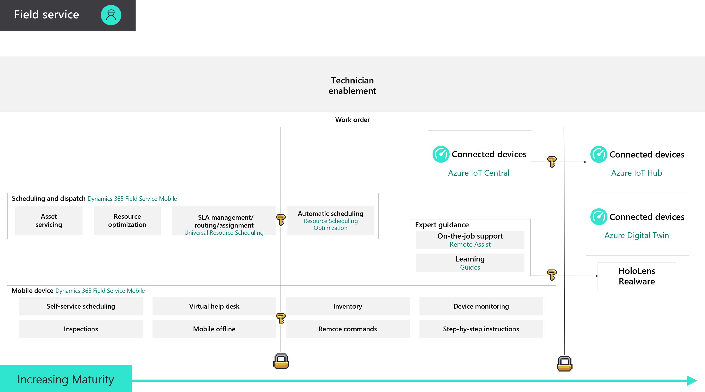

# Learning Plan Resources for Dynamics 365 Field Service

Dynamics 365 Field Service is a Microsoft business application helps organizations deliver onsite service to customer locations. The application combines workflow automation, scheduling algorithms, and mobility to set mobile workers up for success when they're onsite with customers fixing issues.  Field Services ensures the right person, with the right skills and parts, shows up at the right place and right time to improve first-time fix rate, customer satisfaction, and resource productivity. 

Connected Field Service enables organizations to transform the way they provide service from a costly break-fix model to a proactive and predictive service model through the combination of IoT diagnostics, scheduling, asset maintenance, and inventory on the same platform.

Below you will find content to assist in upskilling on Dynamics 365 Field Service and Connected Field Service. Content is broken down as follows:

* Fundamentals, Associate, Expert, Specialist: content categorized in increase levels of complexity
* Certifications: relevant Microsoft exams or certifications
* Community resources: user groups, events, blogs

Additionally, some content may be mared with one or more icons:

* '$' to indicate paid content
* '3rd Party' to indicate 3rd party content (not created by Microsoft)

TIP:  Open resources below in a separate browser tab to remain on this Learning Plan page - Right-Click on link and open in new tab.

## Fundamentals

* [Connected Field Service Overview](https://docs.microsoft.com/en-us/dynamics365/field-service/connected-field-service) (Microsoft Docs)
* [Dynamics 365 Field Service](https://docs.microsoft.com/en-us/learn/modules/dynamics-365-for-field-service/) (Microsoft Learn) (30 Minutes)
* [Get started using Common Data Service](https://docs.microsoft.com/en-us/learn/paths/get-started-cds/) (icrosoft Learn) (4 Hours)
* [IoT Hub](https://azure.microsoft.com/en-us/services/iot-hub/)
* [IoT Central School](https://iotschool.microsoft.com/en-us/search;searchString=iot%20central) (3 Hours)
* [Microsoft Power Platform Fundamentals](https://docs.microsoft.com/en-us/learn/paths/power-plat-fundamentals/) (Microsoft Learn) (3 Hours)

## Associate

* [Register and manage customer devices with Connected Field Service for Dynamics 365 and Azure IoT](https://docs.microsoft.com/en-us/learn/modules/register-and-manage-customer-devices-with-connected-field-service/) (Microsoft Learn) (2 Hours)
* [Remotely monitor and service customer equipment with Connected Field Service for Dynamics 365 and Azure IoT](https://docs.microsoft.com/en-us/learn/modules/remotely-monitor-and-service-customer-equipment/) (Microsoft Learn) (2 Hours)
* [MS Learn: Working with Connected Field Service for Dynamics 365 and Azure IoT](https://docs.microsoft.com/en-us/learn/paths/working-with-connected-field-service-iot/) (Microsoft Learn) (6 Hours)
* [Using IoT Central with Connected Field Service for Dynamics 365](https://docs.microsoft.com/en-us/learn/modules/using-iot-central-with-connected-field-service/) (Microsoft Learn) (1 Hour)
* [Get started with Connected Field Service for Dynamics 365 and Azure IoT](https://docs.microsoft.com/en-us/learn/modules/get-started-with-connected-field-service/) (Microsoft Learn) (2 Hours)
* [Identify Exceptions with Connected Field Service for Dynamics 365 and Azure IoT](https://docs.microsoft.com/en-us/learn/modules/identify-exceptions-with-connected-field-service/) (Microsoft Learn) (2 Hours)
* [Course MB-200T01-A: Dynamics 365: Power Platform applications](https://docs.microsoft.com/en-us/learn/certifications/courses/mb-200t01) (In-person Instructor Led) (2 Days)
* [Automate a business process using Power Automate](https://docs.microsoft.com/en-us/learn/paths/automate-process-power-automate/) (Microsoft Learn) (3 Hours)
* [Azure IoT Platform](https://azure.microsoft.com/en-us/overview/iot/) (1 Hour)
* [Azure IoT Reference Architecture](https://docs.microsoft.com/azure/architecture/reference-architectures/iot/index) (Microsoft Docs) (9 Minutes)
* [Configure Microsoft Dynamics 365 Field Service](https://docs.microsoft.com/en-us/learn/modules/implement-configure-microsoft-dynamics-365-for-field-service/) (Microsoft Learn) (2 Hours)
* [Connected Field Service Demo Builder](https://www.youtube.com/watch?v=7-IibAdfF1s) (Online Instructor Led) (5 Minutes)

## Expert

* [Implementing Customer Engagement Online Learning Path](https://docs.microsoft.com/en-us/learn/paths/implementing-customer-engagement-apps/) (Microsoft Learn) (5 Hours)
* [Intro to developing with the Power Platform](https://docs.microsoft.com/en-us/learn/paths/intro-developing-power-platform/) (Microsoft Learn) (2 Hours)
* [Extending the Common Data Service](https://docs.microsoft.com/en-us/learn/paths/extend-power-platform-common-data-service/) (Microsoft Learn) (2 Hours)
* [Extending the Power Platform user experience Model Driven apps](https://docs.microsoft.com/en-us/learn/paths/extend-power-platform-model-driven-app/) (Microsoft Learn) (4 Hours)
* [Course MB-400T00-A: Microsoft Power Apps + Dynamics 365 Developer](https://docs.microsoft.com/en-us/learn/certifications/courses/mb-400t00) (In-person Instructor Led) (3 Days)
* [Becoming a Solution Architect for Dynamics 365 and Power Platform Learning Path](https://docs.microsoft.com/en-us/learn/paths/become-solution-architect/) (Microsoft Learn) (4 Hours)
* [Implementing Customer Engagement Online Learning Path](https://docs.microsoft.com/en-us/learn/paths/implementing-customer-engagement-apps/) (Microsoft Learn) (5 Hours)
* [Extend Dynamics 365 Portals](https://docs.microsoft.com/en-us/learn/paths/extend-dynamics-365-portals/) (Microsoft Learn) (3 Hours)
* [Extending the Common Data Service](https://docs.microsoft.com/en-us/learn/paths/extend-power-platform-common-data-service/) (Microsoft Learn) (2 Hours)
* [Extending the Power Platform user experience Model Driven apps](https://docs.microsoft.com/en-us/learn/paths/extend-power-platform-model-driven-app/) (Microsoft Learn) (4 Hours)

## Certifications

* [Exam PL-200: Microsoft Power Platform Functional Consultant (beta)](https://docs.microsoft.com/en-us/learn/certifications/exams/pl-200)
    * [Exam MB-200:  Microsoft Dynamics 365 Power Platform + Dynamics Core](https://docs.microsoft.com/en-us/learn/certifications/exams/mb-200) - Retiring Dec. 31, 2020
* [Exam MB-240: Microsoft Dynamics 365 Field Service](https://docs.microsoft.com/en-us/learn/certifications/exams/mb-240) 

* [Exam PL-400: Microsoft Dynamics 365 Power Apps + Developer (beta)](https://docs.microsoft.com/en-us/learn/certifications/exams/pl-400)
    * [Exam MB-400: Microsoft Dynamics 365 Power Apps + Developer](https://docs.microsoft.com/en-us/learn/certifications/exams/mb-400) - Retiring Dec. 31, 2020
* [Exam MB-600: Microsoft Dynamics 365 Power Apps + Solution Architect (beta)](https://docs.microsoft.com/en-us/learn/certifications/exams/mb-600)

* [MB-200: Microsoft Power Platform + Dynamics 365 Core Exam Prep (VILT)](https://partner.microsoft.com/en-us/training/assets/collection/mb-200-microsoft-power-platform-plus-dynamics-365-core#/) (Self-Paced) (10 Hours)
* [MB-240: Microsoft Dynamics 365 Field Service Exam Prep (VILT)](https://partner.microsoft.com/en-us/training/assets/collection/mb-240-microsoft-dynamics-365-field-service#/) (Self-Paced) (10 Hours)
* [MB-400: Microsoft Power Apps + Dynamics 365 Developer Exam Prep (VILT)](https://partner.microsoft.com/en-us/training/assets/collection/mb-400-microsoft-power-apps-dynamics-365-developer#/) (Self-Paced) (8 Hours)

## Community Resources

* [Participate in Power Apps User Group](https://www.powerappsug.com/home)
* [Subscribe to Microsoft Power Apps YouTube Channel](https://www.youtube.com/channel/UCGfWR2ekfRFckLjev6eQYLg)
* [Subscribe to Microsoft Power Automate YouTube Channel](https://www.youtube.com/channel/UCG98S4lL7nwlN8dxSF322bA)
* [Microsoft Power Platform Learning Resources](https://powerapps.microsoft.com/en-us/blog/microsoft-powerapps-learning-resources/)
* [Monitor the Dynamics 365 Blog](https://cloudblogs.microsoft.com/dynamics365/)
* [Azure IoT Device Catalog](https://catalog.azureiotsolutions.com/alldevices)
* [Azure IoT Documentation](https://docs.microsoft.com/en-us/azure/iot-fundamentals/)
* [Monitor the Dynamics 365 Customer Engagement in the Field](https://community.dynamics.com/crm/b/crminthefield)

## Practice Maturity Model

Ordered by entry level features, advanced features, and innovative features.

   