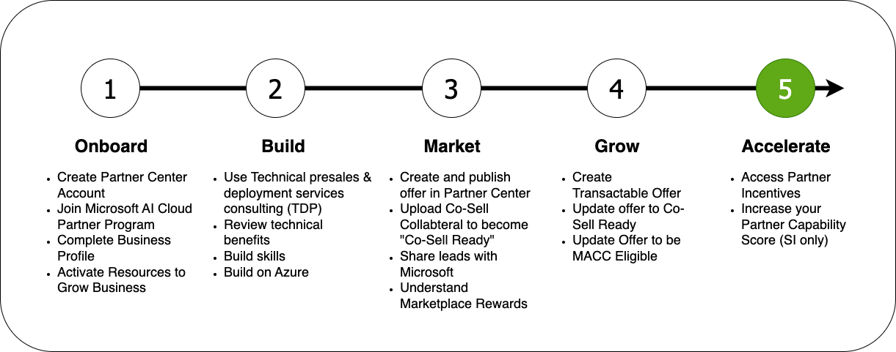



### Welcome to the Microsoft Partner Onboarding Academy, your gateway to your partner journey.

The Microsoft Partner Onboarding Academy's **Modules** are organized into sections which reflect the typical partner journey:

**Accelerating your Co-Sell journey with Microsoft involves a strategic approach to collaborating with Microsoft's sales teams to drive joint revenue.**

To accelerate your Co-sell journey, focus on the following actions.

1. Create and maintain a current business profile on AppSource
1. Earn Solution Partner Designations and Specializations
  - [Improve your Partner Capability Score](https://learn.microsoft.com/en-us/partner-center/membership/partner-capability-score)
1. Accept and send customer referrals in Partner Center
1. Utilize Microsoft incentive programs to win opportunities and accelerate consumption
  - [Access Partner Incentives](https://aka.ms/partnerincentives)

To view the latest partner information, check out the [Microsoft Partner Blog](https://blogs.partner.microsoft.com/partner/).