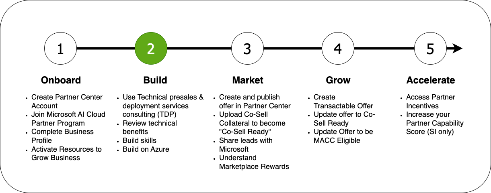



### Welcome to the Microsoft Partner Onboarding Academy, your gateway to your partner journey.

The Microsoft Partner Onboarding Academy's **Modules** are organized into sections which reflect the typical partner journey:

**Discussing how to deploy/run your solution on Azure is out of scope of this document. This document will focus on the benefits available which can enable you to deploy and run on Azure.**

### Technical Presales and Deployment Benefits

* Microsoft provides its partners with technical presales and deployment benefits.
* Some partners are entitled to one-to-one consultations with Microsoft to help sell their services.
* Other benefits include evaluation of solutions, upskilling, architecture guidance, help listing in the appropriate marketplace, and proofs of concept.

For more information on Technical Presales and Deployment Benefits for Microsoft Partners, see **[this article](https://learn.microsoft.com/en-us/partner-center/technical-benefits).**

### Technical Benefits

Microsoft Partners may receive additional benefits from their partnership, including Azure Credits, Visual Studio and GitHub subscriptions, or other Microsoft software.

#### Azure Credits

As a Microsoft Partner, you may be eligible for monthly or one-time Azure credits. You can view your credits at the **[Partner Center Azure Credits Page](https://partner.microsoft.com/dashboard/v2/benefits/azure).** Assign these credits to a user in your organization.

For more information on Azure Credits for Microsoft Partners, see **[this article](https://learn.microsoft.com/en-us/partner-center/mpn-benefits-azure-cloud).**

#### Software

Microsoft Partners may receive Internal Use Rights (IUR) licenses Microsoft software. These benefits are listed in the "Software Benefits" section of **[Partner Center](https://partner.microsoft.com/dashboard/home)**, along with license keys, the last date you may activate the software, and instructions on activating your software.

For more information on Software Benefits for Microsoft Partners, see **[this article](https://learn.microsoft.com/en-us/partner-center/mpn-benefits-software).**

#### Visual Studio and GitHub benefits

As a Microsoft Partner, you may be entitled to licenses for Visual Studio and GitHub Enterprise Cloud subscriptions.

To access these benefits, select "Visual Studio subscriptions benefits" on the "Developer Tools" tab of **[Partner Center](https://partner.microsoft.com/dashboard/home).** Here, you will find the number of available licenses and instructions for assigning them to your users.

See **[this article](https://learn.microsoft.com/en-us/partner-center/mpn-benefits-visual-studio)** for more information on Visual Studio and GitHub benefits for Microsoft Partners.

### Build Skills

- Review the [Partner Skilling events calendar](https://assetsprod.microsoft.com/mpn/microsoft-partner-training-calendar.pdf)
- Subscribe to the [Partner Skilling newsletter](https://aka.ms/PartnerSkillingNewsletter)
- Bookmark the [Microsoft Partner Training resources](https://partner.microsoft.com/training)
- Join an upcoming **[Sales & Pre-Sales Skilling Bootcamp](https://vshow.on24.com/vshow/FY24_SBcamp/registration/23189?partnerref=SEBTCP_ALL_ORG_OTH_PNSKP)** or watch a past bootcamp
- Build advanced technical skills to be **Project Ready** in [Azure](https://vshow.on24.com/vshow/FY24_AZDepth/registration/23172?partnerref=DP_AZ_ORG_OTH_PN), [Security](https://vshow.on24.com/vshow/FY24_SDepth/registration/23173?partnerref=DP_SCI_ORG_OTH_PN), [Modern Work](https://vshow.on24.com/vshow/FY24_MWCWeek/registration/23378?partnerref=DP_MW_ORG_OTH_PNSKP), or [Business Applications](https://vshow.on24.com/vshow/FY24_BADepth/registration/23174?partnerref=DP_BA_ORG_OTH_PN)
- Attend an upcoming **Certification Week** for [Azure](https://vshow.on24.com/vshow/FY24_ACWeek/registration/23191?partnerref=CW_AZ_ORG_OTH_PN), [Security](https://vshow.on24.com/vshow/FY24_SCWeek/registration/23187?partnerref=CW_SCI_ORG_OTH_PN), [Modern Work](https://vshow.on24.com/vshow/FY24_MWCWeek/registration/23184?partnerref=CW_MW_ORG_OTH_PN), or [Business Applications](https://vshow.on24.com/vshow/FY24_BACWeek/registration/23188?partnerref=CW_BA_ORG_OTH_PN)
- Explore additional [Partner Skilling Academies](/PartnerResources/skilling/academies) on this site

### Useful Links

- [Use Technical Presales & Deployment Services Consulting (TDP)](https://learn.microsoft.com/en-us/partner-center/technical-benefits)
- Review Technical Benefits
  - [Azure](https://learn.microsoft.com/en-us/partner-center/mpn-benefits-azure-cloud)
  - [Software](https://learn.microsoft.com/en-us/partner-center/mpn-benefits-software)
  - [Visual Studio & GitHub](https://learn.microsoft.com/en-us/partner-center/mpn-benefits-visual-studio)
- Build Skills
  - [Use Skills Navigator](https://learn.microsoft.com/en-us/collections/mjdcwo2gzmz43)
  - [Earn a Solution Partner Designation](https://partner.microsoft.com/en-us/partnership/solutions-partner) **(OPTIONAL)**
- Build on Azure
  - [Mastering the Marketplace](https://aka.ms/MasteringTheMarketplace)
- [Technical Journeys](https://partner.microsoft.com/en-US/partnership/technical-journeys) — Webinars and technical consultations to help you grow

### Next Steps

The next step is to start **[marketing your solution on Azure](/PartnerResources/skilling/partner-onboarding-academy/market).**
