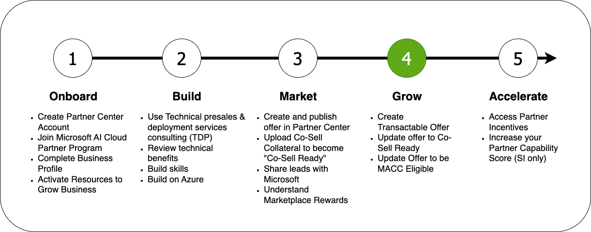



### Welcome to the Microsoft Partner Onboarding Academy, your gateway to your partner journey.

The Microsoft Partner Onboarding Academy's **Modules** are organized into sections which reflect the typical partner journey:

**After publishing an offer to the Marketplace, your next step will be to grow adoption and Co-Selling. These three steps for ISV partners will make your offer attractive to potential customers:**

- **[Create A Transactable Offer](/PartnerResources/skilling/partner-onboarding-academy/transactable-offer):** Transactable Offers are the first step towards Co-Selling with Microsoft.
- **[Update Offer to be IP Co-Sell Eligible](/PartnerResources/skilling/partner-onboarding-academy/cosell):** Make your offer more attractive to customers and Microsoft field-sellers by making your offer **[IP Co-Sell Eligible](https://learn.microsoft.com/en-us/partner-center/co-sell-requirements#requirements-for-azure-ip-co-sell-eligible-status).**
- **[Update Offer to be MACC Eligible](/PartnerResources/skilling/partner-onboarding-academy/macc-offer):** Offers which are **[MACC eligible](https://learn.microsoft.com/en-us/partner-center/marketplace/azure-consumption-commitment-enrollment)** are ideal for customers with an existing agreement.

Additionally, there's a number of online sessions designed to help you grow at the [Microsoft Partner Academy](https://info.microsoft.com/WE-NoGEP-CATALOG-FY23-10Oct-18-Microsoft-Partner-Academy-join-us-for-the-upcoming-sessions-designed-to-help-your-organization-grow-as-a-SRDEM124923_Catalog-Display-Page.html?ocid=lp_pg361111_gdc_comm_mw).

### Next Steps

The next step is to start **[accelerating your solution on Azure](/PartnerResources/skilling/partner-onboarding-academy/accelerate).**
