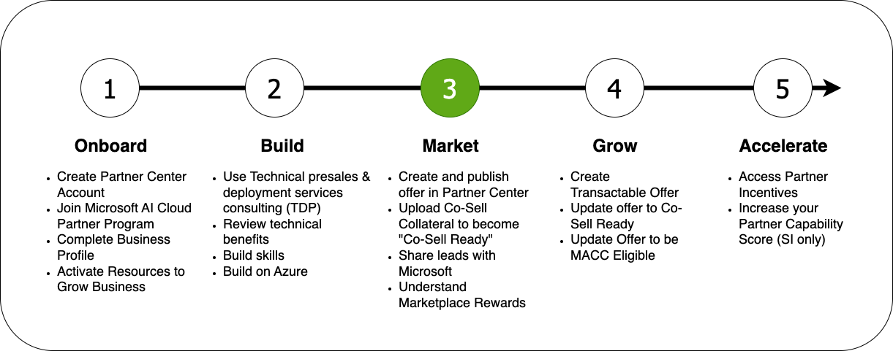



### Welcome to the Microsoft Partner Onboarding Academy, your gateway to your partner journey.

The Microsoft Partner Onboarding Academy's **Modules** are organized into sections which reflect the typical partner journey:

### ISV Specific Considerations

As an ISV, there are many additional programs and offers available:
* [ISV Success Program](https://learn.microsoft.com/en-us/partner-center/isv-success) - 12-month program designed to help ISVs innovate rapidly, build well-architected applications, publish to the Microsoft commercial marketplace, and grow sales
* [Marketplace Rewards](https://learn.microsoft.com/en-us/partner-center/marketplace/marketplace-rewards) - Help to accelerate growth and close more deals 
* [Microsoft for Startups Founders Hub](https://foundershub.startups.microsoft.com/signup) - Provides access to AI tools, free Azure credits and more.
* [Marketplace Transact and Grow](https://partner.microsoft.com/en-us/asset/collection/marketplace-transact-and-grow-incentive-campaign#/) - Cash incentives for initial transactions and additional incentives for beyond
* [ISV Hub](https://www.microsoft.com/ISV)

### Mastering the Marketplace

* Learning Library
* [Webinars](https://aka.ms/MTMwebinars)
* Workshops
* Office Hours
* Technical Accelerators