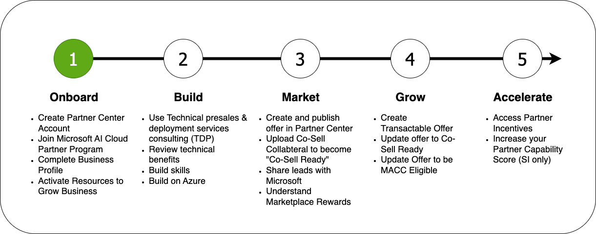



### Welcome to the Microsoft Partner Onboarding Academy, your gateway to your partner journey.

The Microsoft Partner Onboarding Academy's **Modules** are organized into sections which reflect the typical partner journey:

### Onboarding onto the Microsoft AI Cloud Partner Program

The following steps will help you onboard your Partner Onboarding journey:

1. Choose an existing Microsoft Entra tenant or **[create a new one](https://learn.microsoft.com/en-us/azure/active-directory/fundamentals/create-new-tenant).**
1. **[Enroll in Partner Center Account with the tenant](/PartnerResources/skilling/partner-onboarding-academy/acct)** — Microsoft Partner Center is a portal and platform provided by Microsoft for its partners.
1. **[Join Microsoft AI Cloud Partner Program](https://learn.microsoft.com/en-us/partner-center/intro-to-cloud-partner-program-membership)** — There are many partner programs.
    - If you are looking to build and transact a solution on Azure Marketplace, join the [Commercial Marketplace Program](https://learn.microsoft.com/en-us/partner-center/account-settings/create-account).
    - If you are looking to sell Microsoft cloud services, explore the [Cloud Solution Provider program](https://learn.microsoft.com/en-us/partner-center/enroll/enrolling-in-the-csp-program) once onboarded.
1. **[Complete Partner Center account verification](https://learn.microsoft.com/en-us/partner-center/verification-responses)**
1. **[Update Tax and Payment Profile](https://learn.microsoft.com/en-us/partner-center/set-up-your-payout-account)**
1. **[Complete Business Profile](https://learn.microsoft.com/en-us/partner-center/create-a-marketing-profile)**
1. **[Add Publishers in the Commercial Marketplace](https://learn.microsoft.com/en-us/partner-center/add-publishers)** if you enrolled in the Commercial Marketplace program
1. Active Resources to Grow Business **(OPTIONAL)** - While this can be done later in your partner journey, enrolling in these programs will help you in the future.
- **[Partner Success Core](https://learn.microsoft.com/en-us/partner-center/membership/partner-success-core-benefits)** or **[Partner Success Expanded](https://learn.microsoft.com/en-us/partner-center/membership/partner-success-expanded-benefits)** benefits for **Services** and **Channel** partners: Software, support, and benefits for businesses that want to start, build, and grow their Microsoft practice.
  - Follow the steps to [purchase Partner Success Core](https://learn.microsoft.com/en-us/partner-center/membership/partner-success-core-benefits#purchase-partner-success-core-benefits) or [purchase Partner Success Expanded](https://learn.microsoft.com/en-us/partner-center/membership/partner-success-expanded-benefits#purchase-partner-success-expanded-benefits) benefits.
  - **[Meet Criteria for Solutions Partner Designation](https://learn.microsoft.com/en-us/partner-center/membership/introduction-to-pcs)**
    - Specializations and Designations give Services and Channel partners a way to differentiate their organizations by demonstrating deep technical expertise along with experience in specific technical scenarios under each solution area.

- **[ISV Success Build and Publish](https://learn.microsoft.com/en-us/partner-center/membership/isv-success)** benefits for **ISV** partners: Benefits to assist with the building, deployment, publishing, and selling of your application.
  - Follow the steps to [purchase ISV Success Build and Publish](https://learn.microsoft.com/en-us/partner-center/membership/isv-success#enrollment) benefits
  - **[Meet Criteria for Solutions Partner with Certified Software](https://learn.microsoft.com/en-us/partner-center/referrals/solutions-partner-certified-software-designations-benefits)**
    - Certified Software validates the capability of your solution, increases discoverability with Microsoft customers and sellers, and unlocks go-to-market, sales, and marketing benefits.
    
- **[Learn about other benefits in Partner Center](https://learn.microsoft.com/en-us/partner-center/benefits/manage-your-partner-network-benefits):** Azure Credits, Cloud Services, Software Keys, Technical consultations, Developer Tools, Marketing Benefits & Logo Builder.

### Next Steps

The next step is to start **[building your solution on Azure](/PartnerResources/skilling/partner-onboarding-academy/build).**