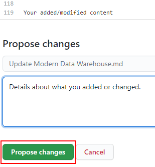
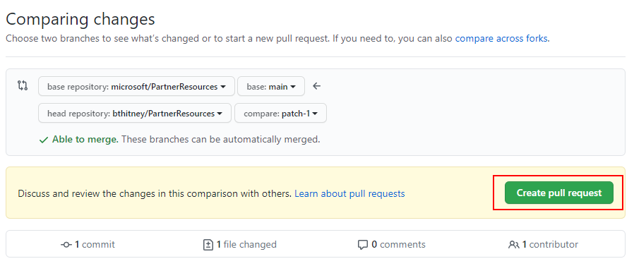

# What are Microsoft Partner Resources?

The Microsoft Partners Resources repository consists of documents, links, and other assets designed to aid partners in developing practices, upskilling, certifications, and taking their solutions to market.  Currently, this repository houses our Learning Plan Resources, with more sections to be added in the future.

# Contributing

This project welcomes contributions and suggestions.  Most contributions require you to agree to a
Contributor License Agreement (CLA) declaring that you have the right to, and actually do, grant us
the rights to use your contribution. For details, visit https://cla.opensource.microsoft.com.

## Modifying a document on Github

For infrequent or small updates, you can edit the file directly on GitHub.com without having installing additional tools and software.  Naturally, use whatever tools/editors you are most comfortable with. For a great explanation of markdown, watch this great video [Markdown Explained in Under 10 Minutes](https://www.youtube.com/watch?v=Y83zrODz-lk) by April Dunham.

1. Make sure you have signed into GitHub.com with your GitHub account.
2. Go to the page you want to edit and click the edit button near the top right:

   

3. A fork of the project will be created in your account for editing purposes. Files in GitHub are written and edited using Markdown language. For help on using Markdown, see [Mastering Markdown](https://guides.github.com/features/mastering-markdown/). Select the **Preview changes** tab to view your changes as you go.  The editor will look like this:

   

6. When you're finished making changes, go to the **Propose file change** section at the bottom of the page:

   - A brief title is required. By default, the title is the name of the file, but you can change it.
   - Optionally, you can enter more details in the **Add an optional extended description** box.

   When you're ready, click the green **Propose file change** button.

      

7. On the **Comparing changes** page that appears, click the green **Create pull request** button. A check will be performed and allow you to confirm the submission.

      

8. A member of the team will review and approve your request, or if there are any issues, will respond with questions or comments.

When you submit a pull request, a CLA bot will automatically determine whether you need to provide
a CLA and decorate the PR appropriately (e.g., status check, comment).  Simply follow the instructions
provided by the bot. You will only need to do this once across all repos using our CLA.

This project has adopted the [Microsoft Open Source Code of Conduct](https://opensource.microsoft.com/codeofconduct/).
For more information see the [Code of Conduct FAQ](https://opensource.microsoft.com/codeofconduct/faq/) or
contact [opencode@microsoft.com](mailto:opencode@microsoft.com) with any additional questions or comments.

# Legal Notices

Microsoft and any contributors grant you a license to the Microsoft documentation and other content
in this repository under the [Creative Commons Attribution 4.0 International Public License](https://creativecommons.org/licenses/by/4.0/legalcode),
see the [LICENSE](LICENSE) file, and grant you a license to any code in the repository under the [MIT License](https://opensource.org/licenses/MIT), see the
[LICENSE-CODE](LICENSE-CODE) file.

Microsoft, Windows, Microsoft Azure and/or other Microsoft products and services referenced in the documentation
may be either trademarks or registered trademarks of Microsoft in the United States and/or other countries.
The licenses for this project do not grant you rights to use any Microsoft names, logos, or trademarks.
Microsoft's general trademark guidelines can be found at https://go.microsoft.com/fwlink/?LinkID=254653.

Privacy information can be found at https://privacy.microsoft.com/en-us/

Microsoft and any contributors reserve all other rights, whether under their respective copyrights, patents,
or trademarks, whether by implication, estoppel or otherwise.

# License

This repository is licensed under MIT license. More info can be found [here](/LICENSE).
